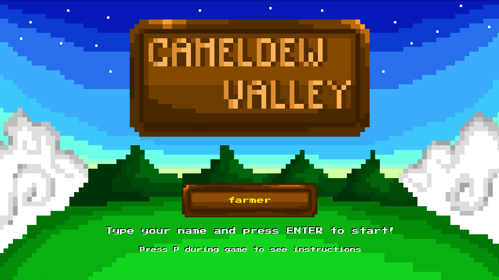
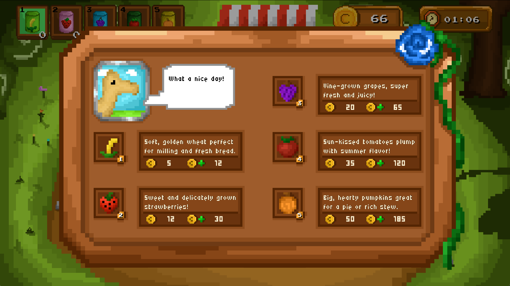
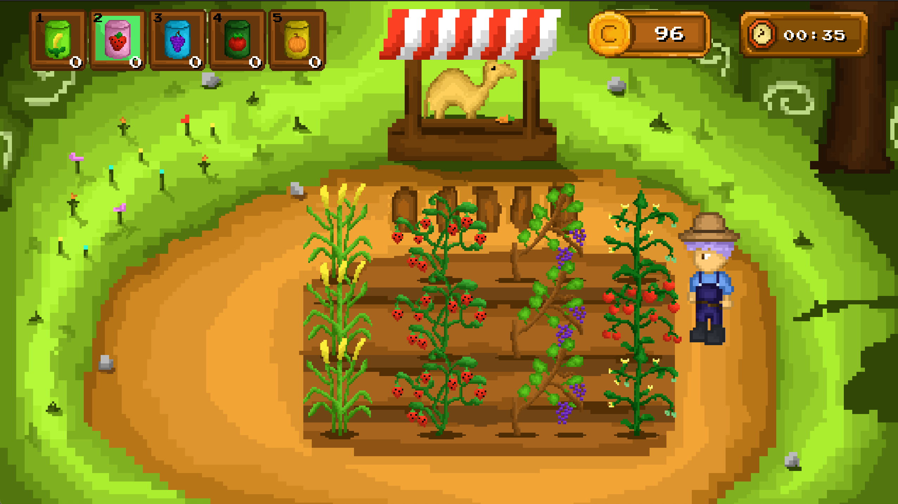
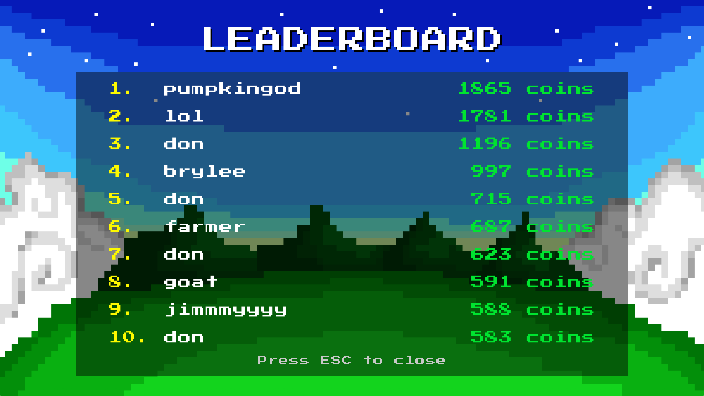

<h1 style="font-size: 18px;">✨⛰️ Cameldew Valley 🌳💫</h1> 

<p> Cameldew Valley is a 2D farming-style sim built from scratch in OCaml using Raylib. Stylistically inspired by Stardew Valley, we put a competitive twist on it. In our game, you have two minutes to rack up as many coins as you can! Players move around a two-dimensional grid, plant seeds on soil tiles, and harvest crops as they reach maturity. Each crop type features distinct growth rates and buy/sell prices. The key to victory is strategy through optimization. 

This project was developed as a collaborative effort and emphasizes learning systems design, graphics programming, and game-state management in a functional programming environment.</p>
<h2>👥 Contributors</h2>
<ul>
  <li> Alex Strugacz </li>
  <li> Jiwon Jeong </li>
  <li> Jimmy Chen </li>
  <li> Donathan Truong </li>
</ul>
<h2>🌟 Features</h2>
<ul>
  <li> 🌱 Crop System
    <ul> <li>5 distinct crops of different buy/sell prices & growth rates</li>
    <li>Plant crops on soil tiles</li>
    <li>Crops grow over time based on in-game time</li>
    <li>Harvest when done for coins!</li></ul>
  </li>
  <li> 🧑‍🌾 Player Movement
    <ul> <li>Grid-aligned movement with directional facing</li>
    <li> Precise walking animations for every direction</li>
    </ul>
  </li>
  <li>🛒 Shop Interface
    <ul> <li>Dedicated shop screen with open/close UI</li>
    <li> Natural crop buying controls</li>
    <li> Descriptive crop information showing buy/sell prices</li>
    </ul>
  </li>
  <li> 🎒 Inventory & Currency
    <ul> <li>Clean inventory UI with selectable slots</li>
    <li>Convenient coin counter</li>
      </ul>
  </li>
  <li> 🕰️ In-game Clock
    <ul> <li>Time progression indicates crop-growth</li>
      </ul>
  </li>
  <li> 🖼️ Multiple Screens
    <ul> <li>Title screen with name input</li>
      <li>Gameplay screen</li>
      <li>Pause screen that displays controls</li>
      <li>End screen with functional leaderboard!</li>
      </ul>
  </li>
</ul>






<h2>🎨 Art & Assets</h2>
<p>
All in-game visuals were created as custom 2D assets outside the engine in Aseprite and
imported into the game as textures. Raylib is used for rendering, animation,
and layering these assets within the game world.
</p>

<h2>🧱 Architecture</h2>

Cameldew Valley follows a Model–View–Controller (MVC)–inspired architecture, organized to keep game logic, rendering, and input handling clearly separated.
```
bin/
├── main.ml        # Application entry point and game loop
└── view/          # Rendering and visual presentation

lib/
├── model/         # Core game state and data definitions
└── controller/    # Input handling and game logic
```

<h2>▶️ Running the Game</h2>
<h4>Requirements</h4>
<ul>
<li>OCaml (≥ 5.x recommended)</li>

<li>Raylib</li>

<li>SQLite3</li>

<li>Dune</li>
</ul>

<h4> Install dependencies (example) </h4>

```
opam install dune raylib sqlite3
```

<h4>Build & Run</h4>

```
dune build
dune exec bin/main.exe
```

<h2>💻 Tech Stack</h2>
<h4>Language</h4>
<ul>
  <li>OCaml</li>

  </ul>
<h4>Graphics</h3>
<ul>
  <li>Raylib (via OCaml bindings)</li>
</ul>
<h4>Build System</h3>
<ul>
  <li>Dune</li>
</ul>
<h4>Database</h3>
<ul>
  <li>SQLite3 (used for leaderboard persistence)</li>
</ul>
